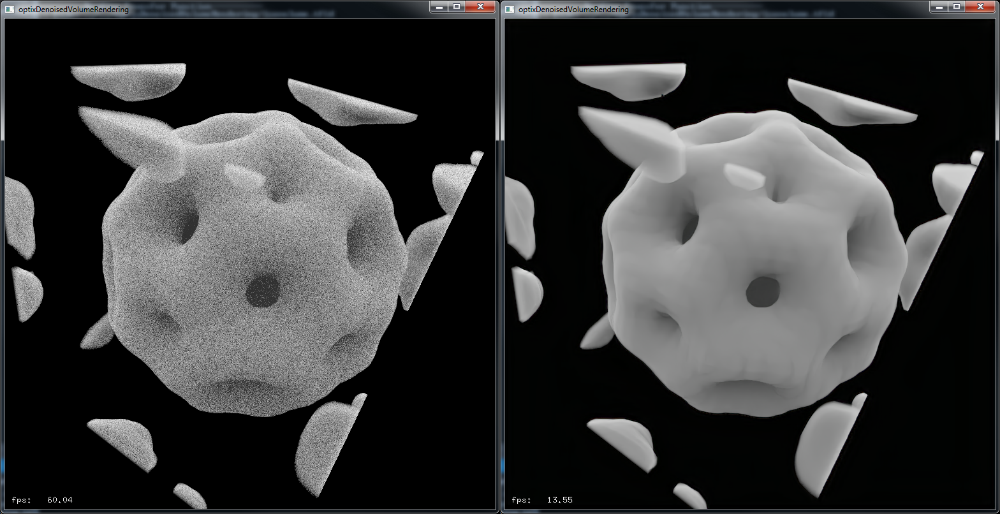

## OptiX Deep Learning Denoiser in Volume Rendering (using OptiX SDK 6.0.0)

A Volume Rendering application using OptiX ray tracing api and the DL Denoiser built in post processing stage. Code based on ["OptiX QuickStart" Tutorial](https://docs.nvidia.com/gameworks/content/gameworkslibrary/optix/optix_quickstart.htm) and [OptiX Denoiser](http://www.sidefx.com/docs/houdini/render/optixdenoiser.html).

Also followed the tip from Brayns visualizer ([github repo](https://github.com/favreau/Brayns/tree/aidenoiser)) to integrate the gradients from each pixel weighting each sample by its current opacity.

### How to use

---

* Clone this repository into OptiXSDKFolder/SDK

* Insert "add_subdirectory(optixDLDenoiserVolumeRendering)" inside OptiXSDKFolder/SDK/CMakeLists.txt

* Use cmake to build the samples

* done!

### Screenshot

---

